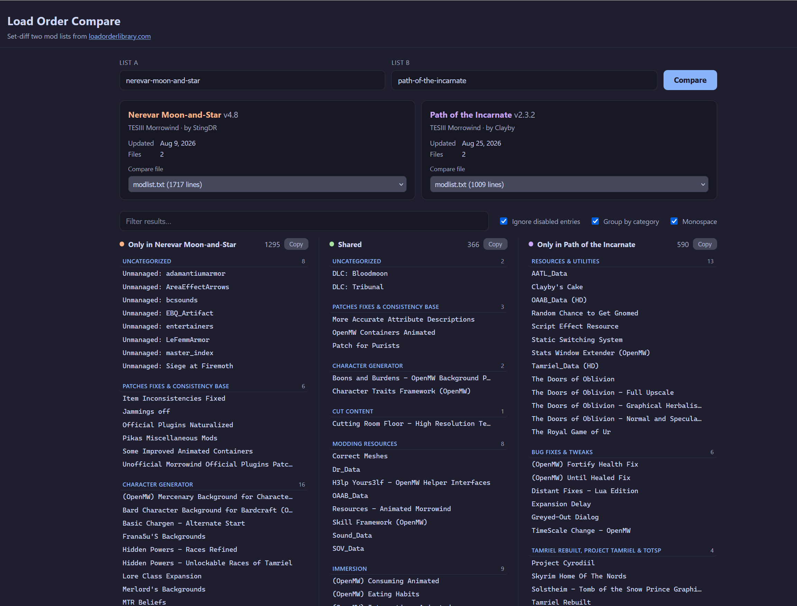

# Load Order Compare



A small web app that does a set diff of two mod lists from [loadorderlibrary.com](https://loadorderlibrary.com).
Given two lists, it shows which plugins/mods are only in one of the two lists or shared by both.

Built for Bethesda-style load orders (Morrowind/Skyrim/Fallout, OpenMW, etc.), but should work with any list on the site (probably, not very well tested yet).

## Why a proxy?

The Load Order Library API only allows browser (CORS) requests from `loadorderlibrary.com` itself, so the page can't call it directly. A tiny server-side proxy (`/api/list/<slug-or-url>`) fetches the data instead. The same frontend runs against either backend:

- `server.js`: a zero-dependency Node server for local use.
- `worker.js`: a Cloudflare Worker (Workers + Static Assets) for deployment.

No API token is needed for public lists.

## Run locally

Zero-dependency Node server (no install needed):

```bash
node server.js
```

Then open http://localhost:5178 (set `PORT` to change it: `PORT=8080 node server.js`).

Or run the Worker exactly as it behaves on Cloudflare, using Wrangler:

```bash
npm install
npm run dev   # wrangler dev
```

## Usage

1. Enter a "slug" (`nerevar-moon-and-star`) or a full URL (`https://loadorderlibrary.com/lists/nerevar-moon-and-star`) for each list.
2. Click "Compare".
3. If a list has multiple files (e.g. `plugins.txt`, `modlist.txt`, `loadorder.txt`), pick which file to compare per side. When a list includes a `modlist.txt`, it is selected by default and grouping is turned on automatically, since that file has the category data.

## How entries are parsed

Each file's lines are normalized so the common formats compare:

| Format          | Example line          | Interpreted as        |
| --------------- | --------------------- | --------------------- |
| `loadorder.txt` | `Morrowind.esm`       | enabled plugin        |
| `plugins.txt`   | `*Dragonborn.esm`     | enabled plugin        |
| `modlist.txt`   | `+Some Mod`           | enabled mod           |
| `modlist.txt`   | `-Some Mod`           | disabled mod          |
| `modlist.txt`   | `+My Group_separator` | category heading (used for grouping) |

Lines starting with `#` (generator banners/comments) and blank lines are ignored. Matching is case-insensitive; the original name is displayed.

## Files

- `public/index.html`, `public/styles.css`, `public/app.js` - the UI and diff logic. Vanilla JS.
- `worker.js` - Cloudflare Worker: serves `public/` (ASSETS binding) + the `/api/list/<slug-or-url>` proxy.
- `server.js` - equivalent zero-dependency Node server (static files + the same proxy) for local use.
- `wrangler.toml` - Cloudflare Worker config (`main = "worker.js"`, `[assets] directory = "./public"`).
